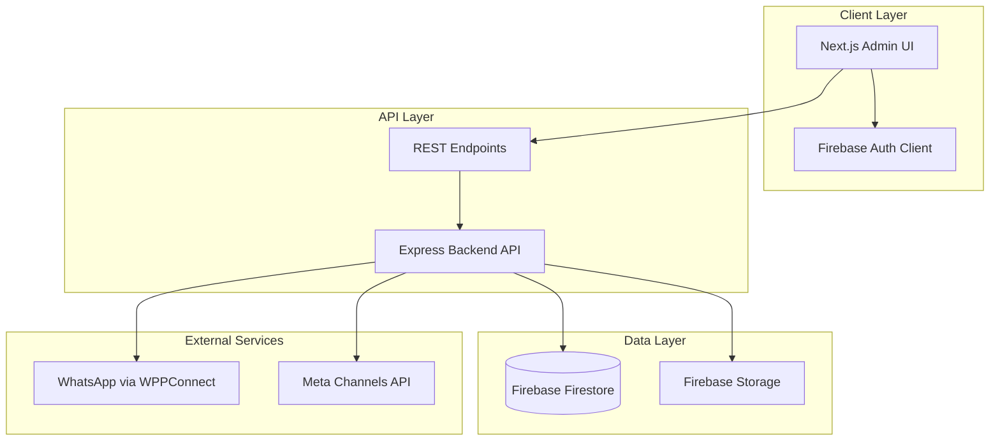

# Design Document: Comprehensive Admin Frontend

## Overview

This design document outlines the architecture and implementation strategy for a comprehensive admin frontend that will replace the existing basic admin-ui. The new frontend will provide a modern, feature-rich interface for managing the WhatsApp AI bot system serving Bosmat Repainting & Detailing Studio.

### Current State

The existing admin-ui is a Next.js application with basic functionality:
- Simple conversation list and message viewing
- Basic message sending capability
- AI state toggle (pause/resume)
- Minimal booking calendar view
- Limited mobile responsiveness

### Target State

The comprehensive admin frontend will be a full-featured administrative dashboard with:
- Multi-channel conversation management (WhatsApp, Instagram DM, Facebook Messenger)
- Advanced conversation filtering and search
- Complete booking management with calendar interface
- CRM dashboard with analytics and customer profiles
- Follow-up campaign management
- Financial transaction tracking and reporting
- Document generation (invoices, receipts)
- System configuration management
- Full mobile responsiveness
- Real-time notifications
- Comprehensive error handling

### Technology Stack (Updated)

- **Frontend Framework**: Next.js 14+ (App Router)
- **Language**: TypeScript
- **UI Library**: React 18+
- **Styling**: Tailwind CSS (Utility-first CSS untuk styling yang cepat dan konsisten)
- **Icons**: Material Symbols Outlined (Google Fonts)
- **Font**: Public Sans (Google Fonts)
- **State Management (Server State)**: TanStack Query (React Query) / SWR (untuk data statis/jarang berubah)
- **Real-time Updates**: Firebase Firestore Realtime Listeners (`onSnapshot`) via Custom Hooks
- **Backend API**: Express.js REST API (existing)
- **Database**: Firebase Firestore (existing)
- **Authentication**: Firebase Authentication

## Design System

### Color Palette (EXACT VALUES FROM HTML DESIGNS)

The application uses a carefully defined color scheme that must be implemented exactly as specified:

**Primary Colors**:
- **Primary/Brand Orange**: `#ec5b13` - Used for active states, buttons, highlights, and brand elements
- **Sidebar Background**: `#0f172a` - Dark navy background for sidebar navigation

**Message Colors**:
- **Outgoing Messages**: `#0a3d82` - Blue background for admin/outgoing messages
- **Incoming Messages**: `bg-slate-100` - Light gray background for customer messages

**Status Badge Colors**:
- **Confirmed/Success**: `bg-green-100 text-green-700` (dark mode: `bg-green-900/30 text-green-400`)
- **Pending**: `bg-amber-100 text-amber-700` (dark mode: `bg-amber-900/30 text-amber-400`)
- **In Progress**: `bg-blue-100 text-blue-700` (dark mode: `bg-blue-900/30 text-blue-400`)
- **Cancelled/Inactive**: `bg-slate-100 text-slate-700` (dark mode: `bg-slate-700 text-slate-300`)

**Interactive States**:
- **Hover (Sidebar)**: `bg-white/5` with icon color changing to primary orange
- **Active Navigation**: `bg-primary/10 text-primary border-l-4 border-primary`
- **Active Chat Item**: `bg-blue-50 border-l-4 border-blue-600`

**Background Colors**:
- **Light Mode Background**: `bg-slate-50` or `bg-background-light` (`#f8f6f6`)
- **Dark Mode Background**: `bg-background-dark` (`#221610`)
- **Card Background**: `bg-white` (light) / `bg-slate-900` (dark)

### Typography

**Font Family**: Public Sans (loaded from Google Fonts)
```html
<link href="https://fonts.googleapis.com/css2?family=Public+Sans:wght@300;400;500;600;700;800;900&display=swap" rel="stylesheet"/>
```

**Font Weights**:
- Light: 300
- Regular: 400
- Medium: 500
- Semibold: 600
- Bold: 700
- Extrabold: 800
- Black: 900

**Text Sizes** (Tailwind classes):
- Page Titles: `text-2xl` or `text-3xl font-bold` or `font-black`
- Section Headers: `text-lg font-bold`
- Body Text: `text-sm` or `text-base`
- Small Text: `text-xs`
- Tiny Text: `text-[10px]` or `text-[11px]`

### Icons

**Icon System**: Material Symbols Outlined (Google Fonts)
```html
<link href="https://fonts.googleapis.com/css2?family=Material+Symbols+Outlined:wght,FILL@100..700,0..1&display=swap" rel="stylesheet"/>
```

**Icon Usage**:
```html
<span class="material-symbols-outlined">icon_name</span>
```

**Common Icons**:
- Dashboard: `dashboard`
- Bookings: `event_available`
- CRM: `group`
- Messages: `chat_bubble`
- Settings: `settings`
- Search: `search`
- Notifications: `notifications`
- Calendar: `calendar_today`
- Add: `add`
- More: `more_vert`, `more_horiz`
- Navigation: `chevron_left`, `chevron_right`, `expand_more`

### Sidebar Design (EXACT IMPLEMENTATION)

The sidebar is consistent across all pages with these exact specifications:

**Structure**:
```html
<aside class="w-full md:w-64 flex-col bg-[#0f172a] p-6 hidden md:flex min-h-screen text-slate-300">
  <!-- Logo Section -->
  <div class="flex items-center gap-3 px-4 mb-8">
    <div class="size-8 bg-white/10 rounded-lg flex items-center justify-center">
      <span class="material-symbols-outlined text-white">account_balance_wallet</span>
    </div>
    <h2 class="text-white text-lg font-bold leading-tight tracking-tight">Bosmat Admin</h2>
  </div>
  
  <!-- Navigation Items -->
  <nav class="flex flex-col gap-1">
    <!-- Inactive Item -->
    <div class="flex items-center gap-3 px-4 py-3 rounded-xl text-slate-300 hover:bg-white/5 hover:text-white transition-colors cursor-pointer group">
      <span class="material-symbols-outlined group-hover:text-primary transition-colors">dashboard</span>
      <span class="text-sm font-medium">Dashboard</span>
    </div>
    
    <!-- Active Item -->
    <div class="flex items-center gap-3 px-4 py-3 rounded-xl bg-primary/10 text-primary border-l-4 border-primary shadow-sm">
      <span class="material-symbols-outlined">event_available</span>
      <span class="text-sm font-semibold">Bookings</span>
    </div>
  </nav>
  
  <!-- Bottom Action Button -->
  <div class="mt-auto pt-4 border-t border-white/10">
    <button class="flex w-full items-center justify-center gap-2 rounded-xl h-11 px-4 bg-primary text-white text-sm font-bold tracking-tight hover:bg-primary/90 transition-all shadow-lg shadow-primary/20">
      <span class="material-symbols-outlined text-[20px]">add</span>
      <span>Generate Invoice</span>
    </button>
  </div>
</aside>
```

**Key Styling Details**:
- Background: `#0f172a` (exact hex value)
- Width: `w-64` on desktop, hidden on mobile (`hidden md:flex`)
- Logo icon container: `size-8 bg-white/10 rounded-lg`
- Navigation gap: `gap-1` between items
- Inactive state: `text-slate-300 hover:bg-white/5`
- Active state: `bg-primary/10 text-primary border-l-4 border-primary`
- Icon hover effect: `group-hover:text-primary`
- Bottom button: Orange with shadow `shadow-lg shadow-primary/20`

### Component Patterns

#### 1. Status Badges

```html
<!-- Confirmed/Success -->
<span class="inline-flex items-center px-2.5 py-0.5 rounded-full text-xs font-medium bg-green-100 text-green-700 dark:bg-green-900/30 dark:text-green-400">
  Confirmed
</span>

<!-- Pending -->
<span class="inline-flex items-center px-2.5 py-0.5 rounded-full text-xs font-medium bg-amber-100 text-amber-700 dark:bg-amber-900/30 dark:text-amber-400">
  Pending
</span>

<!-- In Progress -->
<span class="inline-flex items-center px-2.5 py-0.5 rounded-full text-xs font-medium bg-blue-100 text-blue-700 dark:bg-blue-900/30 dark:text-blue-400">
  In Progress
</span>

<!-- Cancelled -->
<span class="inline-flex items-center px-2.5 py-0.5 rounded-full text-xs font-medium bg-slate-100 text-slate-700 dark:bg-slate-700 dark:text-slate-300">
  Cancelled
</span>
```

#### 2. Search Input with Icon

```html
<div class="relative">
  <span class="absolute inset-y-0 left-0 flex items-center pl-3">
    <span class="material-symbols-outlined text-slate-400 text-lg">search</span>
  </span>
  <input 
    class="w-full pl-10 pr-4 py-2 text-sm border-slate-200 rounded-lg focus:ring-primary focus:border-primary" 
    placeholder="Search..." 
    type="text"
  />
</div>
```

#### 3. Card Component

```html
<div class="bg-white dark:bg-slate-900 p-6 rounded-xl border border-slate-200 dark:border-slate-800 shadow-sm">
  <!-- Card content -->
</div>
```

#### 4. Stats Card

```html
<div class="bg-white dark:bg-slate-900 p-6 rounded-xl border border-slate-200 dark:border-slate-800 shadow-sm">
  <div class="flex items-center justify-between mb-4">
    <span class="text-slate-500 text-sm font-medium uppercase tracking-wider">Total Revenue</span>
    <div class="p-2 bg-primary/10 rounded-lg">
      <span class="material-symbols-outlined text-primary">trending_up</span>
    </div>
  </div>
  <div class="flex items-baseline gap-2">
    <h3 class="text-3xl font-bold text-slate-900 dark:text-slate-100">$128,430.00</h3>
    <span class="text-emerald-500 text-sm font-semibold flex items-center">
      <span class="material-symbols-outlined text-sm">trending_up</span> 12.5%
    </span>
  </div>
  <p class="text-slate-400 text-xs mt-2">from last month</p>
</div>
```

#### 5. Table Pattern

```html
<table class="w-full text-left">
  <thead class="bg-slate-50 dark:bg-slate-800/50 border-b border-slate-200 dark:border-slate-800">
    <tr>
      <th class="px-6 py-4 text-xs font-bold text-slate-500 uppercase tracking-wider">Column</th>
    </tr>
  </thead>
  <tbody class="divide-y divide-slate-200 dark:divide-slate-800">
    <tr class="hover:bg-slate-50 dark:hover:bg-slate-800/30 transition-colors">
      <td class="px-6 py-4 text-sm text-slate-600 dark:text-slate-300">Data</td>
    </tr>
  </tbody>
</table>
```

#### 6. Button Variants

```html
<!-- Primary Button -->
<button class="px-8 py-2.5 bg-primary text-white font-bold rounded-xl shadow-lg shadow-primary/25 hover:brightness-110 active:scale-95 transition-all">
  Save Changes
</button>

<!-- Secondary Button -->
<button class="px-6 py-2 text-slate-600 dark:text-slate-400 font-semibold hover:text-slate-900 dark:hover:text-slate-100 transition-colors">
  Cancel
</button>

<!-- Icon Button -->
<button class="flex items-center justify-center rounded-xl h-10 w-10 bg-slate-100 dark:bg-slate-900 text-slate-600 dark:text-slate-300 hover:bg-slate-200 dark:hover:bg-slate-800 transition-colors">
  <span class="material-symbols-outlined">notifications</span>
</button>
```

### Layout Patterns

#### 1. Conversations Page (Split View)

- **Layout**: 1/3 chat list, 2/3 chat window
- **Chat List**: Scrollable list with search and filter at top
- **Active Item**: `bg-blue-50 border-l-4 border-blue-600`
- **Message Bubbles**: 
  - Incoming: `bg-slate-100 rounded-xl rounded-bl-none`
  - Outgoing: `bg-[#0a3d82] text-white rounded-xl rounded-br-none`

#### 2. Bookings Page (Calendar + Sidebar)

- **Layout**: `grid grid-cols-1 lg:grid-cols-12 gap-6`
- **Calendar**: `lg:col-span-8` - Grid-based calendar with border cells
- **Sidebar**: `lg:col-span-4` - Upcoming bookings list + stats card
- **Calendar Cells**: `min-h-[100px] border-r border-b border-slate-100`
- **Current Day**: `bg-primary/5` with `bg-primary text-white rounded-full` date badge

#### 3. CRM Page (Stats + Table)

- **Stats Grid**: `grid grid-cols-1 md:grid-cols-2 lg:grid-cols-4 gap-6`
- **Table**: Full-width with hover effects
- **Pagination**: Bottom bar with page numbers

#### 4. Settings Page (Form Sections)

- **Layout**: `grid grid-cols-1 lg:grid-cols-3 gap-8`
- **Main Content**: `lg:col-span-2` - Form sections
- **Sidebar**: `lg:col-span-1` - Service catalog
- **Textarea**: Large for system prompt editing

#### 5. Finance Page (Stats + Charts + Table)

- **Stats Grid**: 4 columns on desktop
- **Charts Area**: `grid grid-cols-1 lg:grid-cols-3 gap-6`
- **Revenue Chart**: `lg:col-span-2` - Bar chart visualization
- **Calendar Widget**: `lg:col-span-1` - Mini calendar

### Responsive Breakpoints

```css
/* Mobile First Approach */
- Base: < 768px (mobile)
- md: >= 768px (tablet)
- lg: >= 1024px (desktop)

/* Sidebar Visibility */
- Mobile: hidden
- Tablet+: visible (md:flex)

/* Grid Layouts */
- Mobile: 1 column
- Tablet: 2 columns (md:grid-cols-2)
- Desktop: 3-4 columns (lg:grid-cols-3, lg:grid-cols-4)
```

### Tailwind Configuration

```javascript
// tailwind.config.js
tailwind.config = {
  darkMode: "class",
  theme: {
    extend: {
      colors: {
        "primary": "#ec5b13",
        "background-light": "#f8f6f6",
        "background-dark": "#221610",
      },
      fontFamily: {
        "display": ["Public Sans", "sans-serif"]
      },
      borderRadius: {
        "DEFAULT": "0.25rem",
        "lg": "0.5rem",
        "xl": "0.75rem",
        "full": "9999px"
      },
    },
  },
}
```

### Page-Specific Design Specifications

#### Conversations Page

**Layout Structure**:
```html
<div class="flex-1 flex bg-white rounded-lg shadow-sm border overflow-hidden">
  <!-- Chat List (1/3 width) -->
  <div class="w-1/3 border-r flex flex-col">
    <!-- Search and Filter Section -->
    <div class="p-4 space-y-3">
      <div class="relative">
        <span class="absolute inset-y-0 left-0 flex items-center pl-3">
          <svg class="w-4 h-4 text-slate-400">...</svg>
        </span>
        <input class="w-full pl-10 pr-4 py-2 text-sm border-slate-200 rounded-lg" 
               placeholder="Cari nama, nomor, atau pesan" />
      </div>
      <select class="w-full pl-3 pr-10 py-2 text-sm border-slate-200 rounded-lg">
        <option>Semua label</option>
      </select>
    </div>
    
    <!-- Conversation List Items -->
    <div class="flex-1 overflow-y-auto custom-scrollbar">
      <!-- Active Item -->
      <div class="flex items-start gap-3 p-4 bg-blue-50 border-l-4 border-blue-600 cursor-pointer">
        
        <div class="flex-1 min-w-0">
          <div class="flex justify-between items-baseline">
            <h3 class="font-semibold text-sm truncate text-slate-900">Name</h3>
            <span class="text-[10px] text-slate-500 uppercase">10:30 AM</span>
          </div>
          <p class="text-xs text-slate-600 truncate">Last message...</p>
        </div>
      </div>
      
      <!-- Inactive Item -->
      <div class="flex items-start gap-3 p-4 hover:bg-slate-50 cursor-pointer border-b border-slate-50">
        <!-- Same structure as active -->
      </div>
    </div>
  </div>
  
  <!-- Chat Window (2/3 width) -->
  <div class="flex-1 flex flex-col h-full bg-white">
    <!-- Chat Header -->
    <div class="h-14 border-b flex items-center justify-between px-6 shrink-0">
      <h3 class="font-semibold"></h3>
      <button class="text-slate-400 hover:text-slate-600">
        <span class="material-symbols-outlined">more_vert</span>
      </button>
    </div>
    
    <!-- Message History -->
    <div class="flex-1 p-6 overflow-y-auto custom-scrollbar space-y-6">
      <!-- Incoming Message -->
      <div class="flex items-start gap-3">
        
        <div>
          <div class="bg-slate-100 p-4 rounded-xl rounded-bl-none text-sm max-w-lg leading-relaxed">
            Message text
          </div>
          <div class="mt-1 text-[10px] text-slate-400">Admin, 10:30 AM</div>
        </div>
      </div>
      
      <!-- Outgoing Message -->
      <div class="flex flex-col items-end">
        <div class="bg-[#0a3d82] text-white p-4 rounded-xl rounded-br-none text-sm max-w-lg leading-relaxed shadow-sm">
          Message text
        </div>
        <div class="mt-1 text-[10px] text-slate-400">10:30 AM</div>
      </div>
    </div>
    
    <!-- Message Input -->
    <div class="p-4 border-t">
      <div class="flex items-center gap-2 border border-slate-200 rounded-lg p-2 focus-within:ring-2 focus-within:ring-blue-100">
        <input class="flex-1 border-none focus:ring-0 text-sm py-2" placeholder="Ketik pesan..." />
        <button class="bg-[#0a3d82] text-white p-2 rounded-md hover:bg-blue-800">
          <svg class="w-5 h-5 transform rotate-90">...</svg>
        </button>
      </div>
    </div>
  </div>
</div>
```

**Key Design Elements**:
- Split view: 1/3 list, 2/3 chat window
- Active chat: `bg-blue-50 border-l-4 border-blue-600`
- Incoming messages: `bg-slate-100 rounded-xl rounded-bl-none`
- Outgoing messages: `bg-[#0a3d82] text-white rounded-xl rounded-br-none`
- Custom scrollbar styling for smooth scrolling
- Avatar images: `w-10 h-10 rounded-full` in list, `w-8 h-8` in chat

#### Bookings Page

**Layout Structure**:
```html
<div class="p-6 grid grid-cols-1 lg:grid-cols-12 gap-6">
  <!-- Calendar Section (8 columns) -->
  <div class="lg:col-span-8 bg-white dark:bg-slate-950 p-6 rounded-xl border shadow-sm">
    <!-- Calendar Header -->
    <div class="flex items-center justify-between mb-6">
      <div class="flex items-center gap-4">
        <h3 class="text-lg font-bold">October 2023</h3>
        <div class="flex gap-1">
          <button class="p-1 hover:bg-slate-100 rounded-lg">
            <span class="material-symbols-outlined">chevron_left</span>
          </button>
          <button class="p-1 hover:bg-slate-100 rounded-lg">
            <span class="material-symbols-outlined">chevron_right</span>
          </button>
        </div>
      </div>
      <button class="text-primary font-semibold text-sm hover:underline">Today</button>
    </div>
    
    <!-- Calendar Grid -->
    <div class="grid grid-cols-7 border-t border-l border-slate-100">
      <!-- Day Headers -->
      <div class="p-3 text-center text-xs font-bold text-slate-400 uppercase border-r border-b bg-slate-50">
        Sun
      </div>
      <!-- Repeat for all days -->
      
      <!-- Calendar Cells -->
      <div class="min-h-[100px] border-r border-b border-slate-100 p-2">
        <div class="text-sm font-semibold mb-1">5</div>
        <!-- Booking Items -->
        <div class="bg-primary/20 text-primary text-[10px] font-bold p-1 rounded border-l-2 border-primary mb-1">
          10:00 - Deep Clean
        </div>
      </div>
      
      <!-- Current Day Highlight -->
      <div class="min-h-[100px] border-r border-b border-slate-100 p-2 bg-primary/5">
        <div class="flex items-center justify-between mb-1">
          <div class="text-sm font-bold h-6 w-6 flex items-center justify-center bg-primary text-white rounded-full">
            5
          </div>
        </div>
        <!-- Bookings -->
      </div>
    </div>
  </div>
  
  <!-- Upcoming Bookings Sidebar (4 columns) -->
  <div class="lg:col-span-4 flex flex-col gap-6">
    <div class="bg-white p-6 rounded-xl border shadow-sm flex-1">
      <div class="flex items-center justify-between mb-6">
        <h3 class="text-lg font-bold">Upcoming Bookings</h3>
        <button class="text-primary text-sm font-semibold">View All</button>
      </div>
      
      <!-- Booking Cards -->
      <div class="flex flex-col gap-4">
        <!-- Confirmed Booking -->
        <div class="p-3 rounded-xl border border-slate-100 hover:border-primary/30 transition-all group">
          <div class="flex justify-between items-start mb-2">
            <span class="px-2 py-0.5 rounded text-[10px] font-bold uppercase tracking-wider bg-green-100 text-green-700">
              Confirmed
            </span>
            <button class="text-slate-400 group-hover:text-primary">
              <span class="material-symbols-outlined text-sm">more_horiz</span>
            </button>
          </div>
          <h4 class="font-bold text-sm">Alice Thompson</h4>
          <p class="text-xs text-slate-500 mb-2">Deep Cleaning Service</p>
          <div class="flex items-center gap-3 text-xs text-slate-600">
            <div class="flex items-center gap-1">
              <span class="material-symbols-outlined text-xs">calendar_today</span>
              Today, 14:00
            </div>
            <div class="flex items-center gap-1">
              <span class="material-symbols-outlined text-xs">timer</span>
              3h
            </div>
          </div>
        </div>
      </div>
    </div>
    
    <!-- Stats Card -->
    <div class="bg-primary p-6 rounded-xl text-white shadow-lg">
      <h3 class="text-sm font-bold uppercase tracking-widest opacity-80 mb-4">Today's Summary</h3>
      <div class="grid grid-cols-2 gap-4">
        <div class="bg-white/10 p-3 rounded-lg backdrop-blur-sm">
          <p class="text-2xl font-bold">12</p>
          <p class="text-xs opacity-80">Total Jobs</p>
        </div>
        <!-- More stats -->
      </div>
    </div>
  </div>
</div>
```

**Key Design Elements**:
- Calendar grid: 7 columns with bordered cells
- Current day: `bg-primary/5` with circular date badge
- Booking items: Color-coded by status with left border
- Sidebar cards: Hover effects with border color change
- Stats card: Orange background with white/10 opacity boxes

#### CRM Page

**Layout Structure**:
```html
<!-- Analytics Cards Grid -->
<div class="grid grid-cols-1 md:grid-cols-2 lg:grid-cols-4 gap-6">
  <div class="bg-white p-6 rounded-xl border shadow-sm">
    <div class="flex items-center justify-between mb-4">
      <span class="text-slate-500 text-sm font-medium uppercase tracking-wider">Total Customers</span>
      <div class="p-2 bg-primary/10 rounded-lg">
        <span class="material-symbols-outlined text-primary">groups</span>
      </div>
    </div>
    <div class="flex items-baseline gap-2">
      <h3 class="text-3xl font-bold text-slate-900">1,284</h3>
      <span class="text-emerald-500 text-sm font-semibold flex items-center">
        <span class="material-symbols-outlined text-sm">trending_up</span> 12%
      </span>
    </div>
    <p class="text-slate-400 text-xs mt-2">from 1,146 last month</p>
  </div>
  <!-- Repeat for other stats -->
</div>

<!-- Customer Table -->
<div class="bg-white rounded-xl border shadow-sm overflow-hidden">
  <div class="p-6 border-b flex items-center justify-between">
    <h3 class="text-lg font-bold">Customer Directory</h3>
    <div class="flex items-center gap-3">
      <div class="relative">
        <span class="material-symbols-outlined absolute left-3 top-1/2 -translate-y-1/2 text-slate-400">
          search
        </span>
        <input class="pl-10 pr-4 py-2 border rounded-xl text-sm focus:ring-2 focus:ring-primary w-64" 
               placeholder="Search customers..." />
      </div>
      <button class="flex items-center gap-2 px-4 py-2 bg-primary text-white rounded-xl text-sm font-bold">
        <span class="material-symbols-outlined">add</span>
        Add Customer
      </button>
    </div>
  </div>
  
  <table class="w-full text-left">
    <thead class="bg-slate-50 border-b">
      <tr>
        <th class="px-6 py-4 text-xs font-bold text-slate-500 uppercase tracking-wider">Customer</th>
        <th class="px-6 py-4 text-xs font-bold text-slate-500 uppercase tracking-wider">Status</th>
        <th class="px-6 py-4 text-xs font-bold text-slate-500 uppercase tracking-wider">Follow-up</th>
        <th class="px-6 py-4 text-xs font-bold text-slate-500 uppercase tracking-wider">Last Interaction</th>
        <th class="px-6 py-4 text-xs font-bold text-slate-500 uppercase tracking-wider text-right">Actions</th>
      </tr>
    </thead>
    <tbody class="divide-y divide-slate-200">
      <tr class="hover:bg-slate-50 transition-colors">
        <td class="px-6 py-4">
          <div class="flex items-center gap-3">
            <div class="w-10 h-10 rounded-full bg-slate-200 flex items-center justify-center font-bold text-slate-600">
              JS
            </div>
            <div>
              <p class="text-sm font-semibold text-slate-900">John Simmons</p>
              <p class="text-xs text-slate-400">john.s@example.com</p>
            </div>
          </div>
        </td>
        <td class="px-6 py-4">
          <span class="inline-flex items-center px-2.5 py-0.5 rounded-full text-xs font-medium bg-emerald-100 text-emerald-800">
            Active Client
          </span>
        </td>
        <!-- More columns -->
      </tr>
    </tbody>
  </table>
  
  <!-- Pagination -->
  <div class="px-6 py-4 bg-slate-50 border-t flex items-center justify-between">
    <p class="text-xs text-slate-500">Showing 1 to 4 of 1,284 results</p>
    <div class="flex items-center gap-2">
      <button class="p-1 rounded border disabled:opacity-50" disabled>
        <span class="material-symbols-outlined">chevron_left</span>
      </button>
      <button class="px-3 py-1 text-xs font-bold bg-primary text-white rounded">1</button>
      <button class="px-3 py-1 text-xs font-medium hover:bg-slate-200 rounded">2</button>
      <!-- More pages -->
    </div>
  </div>
</div>
```

**Key Design Elements**:
- 4-column stats grid on desktop
- Icon badges in colored backgrounds
- Trend indicators with arrows
- Full-width table with hover effects
- Avatar circles with initials
- Pagination with active state styling

#### Settings Page

**Layout Structure**:
```html
<div class="grid grid-cols-1 lg:grid-cols-3 gap-8">
  <!-- Main Content (2 columns) -->
  <div class="lg:col-span-2 space-y-8">
    <!-- AI System Configuration -->
    <section class="bg-white p-6 rounded-xl border shadow-sm">
      <div class="flex items-center gap-2 mb-4">
        <span class="material-symbols-outlined text-primary">smart_toy</span>
        <h3 class="text-lg font-bold">System Configuration</h3>
      </div>
      <div class="space-y-4">
        <div>
          <label class="block text-sm font-semibold text-slate-700 mb-2">AI System Prompt</label>
          <textarea 
            class="w-full rounded-xl border-slate-200 bg-slate-50 text-sm focus:ring-primary focus:border-primary" 
            rows="8"
            placeholder="Define how the AI should interact..."
          >Prompt text</textarea>
          <p class="mt-2 text-xs text-slate-400 italic">This prompt guides the AI chatbot behavior.</p>
        </div>
      </div>
    </section>
    
    <!-- Promotions Section -->
    <section class="bg-white p-6 rounded-xl border shadow-sm">
      <div class="flex items-center gap-2 mb-4">
        <span class="material-symbols-outlined text-primary">campaign</span>
        <h3 class="text-lg font-bold">Promotions</h3>
      </div>
      <div class="space-y-4">
        <div>
          <label class="block text-sm font-semibold text-slate-700 mb-2">Current Promotion Text</label>
          <input 
            class="w-full rounded-xl border-slate-200 bg-slate-50 text-sm focus:ring-primary" 
            type="text" 
            value="Summer Special: 20% off..."
          />
        </div>
        <div class="flex items-center gap-4">
          <div class="flex-1">
            <label class="block text-sm font-semibold text-slate-700 mb-2">Discount Code</label>
            <input class="w-full rounded-xl border-slate-200 bg-slate-50 text-sm" type="text" />
          </div>
          <div class="w-32">
            <label class="block text-sm font-semibold text-slate-700 mb-2">Status</label>
            <div class="flex items-center h-10">
              <!-- Toggle switch -->
            </div>
          </div>
        </div>
      </div>
    </section>
  </div>
  
  <!-- Service Catalog Sidebar (1 column) -->
  <div class="lg:col-span-1">
    <section class="bg-white p-6 rounded-xl border shadow-sm h-full flex flex-col">
      <div class="flex items-center justify-between mb-6">
        <div class="flex items-center gap-2">
          <span class="material-symbols-outlined text-primary">inventory_2</span>
          <h3 class="text-lg font-bold">Services</h3>
        </div>
        <button class="p-1 rounded-lg bg-primary/10 text-primary hover:bg-primary/20">
          <span class="material-symbols-outlined">add</span>
        </button>
      </div>
      
      <div class="space-y-3 flex-1 overflow-y-auto">
        <!-- Service Item -->
        <div class="p-3 rounded-lg border bg-slate-50 flex items-center justify-between group">
          <div>
            <p class="text-sm font-bold text-slate-900">Full Detailing</p>
            <p class="text-xs text-slate-500">$199.00 • 4 hrs</p>
          </div>
          <div class="flex gap-1 opacity-0 group-hover:opacity-100 transition-opacity">
            <button class="p-1 text-slate-400 hover:text-primary">
              <span class="material-symbols-outlined text-sm">edit</span>
            </button>
            <button class="p-1 text-slate-400 hover:text-red-500">
              <span class="material-symbols-outlined text-sm">delete</span>
            </button>
          </div>
        </div>
      </div>
    </section>
  </div>
</div>

<!-- Footer Actions -->
<div class="flex items-center justify-end gap-4 pt-6 border-t">
  <button class="px-6 py-2 text-slate-600 font-semibold hover:text-slate-900">Cancel</button>
  <button class="px-8 py-2.5 bg-primary text-white font-bold rounded-xl shadow-lg shadow-primary/25 hover:brightness-110 active:scale-95">
    Save Changes
  </button>
</div>
```

**Key Design Elements**:
- 3-column grid: 2 for forms, 1 for sidebar
- Large textarea for system prompt
- Toggle switches for status
- Service items with hover-reveal actions
- Footer action buttons with different styles

#### Finance Page

**Layout Structure**:
```html
<!-- Stats Cards -->
<div class="grid grid-cols-1 sm:grid-cols-2 lg:grid-cols-4 gap-4">
  <div class="flex flex-col gap-3 rounded-2xl p-6 bg-white border shadow-sm">
    <div class="flex items-center justify-between">
      <p class="text-slate-500 text-sm font-medium">Total Revenue</p>
      <span class="material-symbols-outlined text-primary text-[20px]">trending_up</span>
    </div>
    <p class="text-slate-900 text-3xl font-bold">$128,430.00</p>
    <div class="flex items-center gap-1">
      <span class="text-emerald-500 text-xs font-bold">+12.5%</span>
      <span class="text-slate-400 text-[10px]">vs last month</span>
    </div>
  </div>
  <!-- More stats -->
</div>

<!-- Charts Area -->
<div class="grid grid-cols-1 lg:grid-cols-3 gap-6">
  <!-- Revenue Chart (2 columns) -->
  <div class="lg:col-span-2 flex flex-col rounded-2xl bg-white border p-6 shadow-sm">
    <div class="flex items-center justify-between mb-6">
      <h3 class="text-lg font-bold">Revenue by Service</h3>
      <select class="text-xs font-semibold rounded-lg border py-1">
        <option>Weekly</option>
      </select>
    </div>
    <div class="h-64 w-full bg-slate-50 rounded-xl relative overflow-hidden">
      <div class="absolute inset-0 flex items-end justify-between px-4 pb-4 gap-2">
        <div class="w-full bg-primary/20 rounded-t-lg h-[40%]"></div>
        <div class="w-full bg-primary/30 rounded-t-lg h-[60%]"></div>
        <div class="w-full bg-primary/40 rounded-t-lg h-[80%]"></div>
        <div class="w-full bg-primary rounded-t-lg h-[100%]"></div>
        <!-- More bars -->
      </div>
    </div>
    <div class="flex justify-between mt-4 text-[11px] text-slate-400 font-medium">
      <span>MON</span><span>TUE</span><span>WED</span><!-- More days -->
    </div>
  </div>
  
  <!-- Calendar Widget (1 column) -->
  <div class="flex flex-col rounded-2xl bg-white border p-6 shadow-sm">
    <div class="flex items-center justify-between mb-4">
      <button class="material-symbols-outlined text-slate-400">chevron_left</button>
      <p class="font-bold">October 2023</p>
      <button class="material-symbols-outlined text-slate-400">chevron_right</button>
    </div>
    <!-- Mini calendar grid -->
  </div>
</div>

<!-- Transaction Table -->
<div class="flex flex-col rounded-2xl bg-white border shadow-sm overflow-hidden">
  <div class="px-6 py-4 border-b flex items-center justify-between">
    <h3 class="text-lg font-bold">Recent Transactions</h3>
    <button class="text-primary text-sm font-bold hover:underline">View All</button>
  </div>
  <table class="w-full text-left">
    <thead>
      <tr class="bg-slate-50">
        <th class="px-6 py-3 text-[11px] font-bold text-slate-400 uppercase tracking-wider">Date</th>
        <th class="px-6 py-3 text-[11px] font-bold text-slate-400 uppercase tracking-wider">Customer</th>
        <th class="px-6 py-3 text-[11px] font-bold text-slate-400 uppercase tracking-wider">Service</th>
        <th class="px-6 py-3 text-[11px] font-bold text-slate-400 uppercase tracking-wider">Amount</th>
        <th class="px-6 py-3 text-[11px] font-bold text-slate-400 uppercase tracking-wider">Payment Method</th>
        <th class="px-6 py-3 text-[11px] font-bold text-slate-400 uppercase tracking-wider">Status</th>
      </tr>
    </thead>
    <tbody class="divide-y divide-slate-100">
      <tr class="hover:bg-slate-50 transition-colors">
        <td class="px-6 py-4 text-sm text-slate-600">Oct 12, 2023</td>
        <td class="px-6 py-4">
          <div class="flex items-center gap-3">
            <div class="size-8 rounded-full bg-slate-200" style="background-image: url(...)"></div>
            <span class="text-sm font-semibold">Sarah Jenkins</span>
          </div>
        </td>
        <td class="px-6 py-4 text-sm text-slate-600">Financial Consulting</td>
        <td class="px-6 py-4 text-sm font-bold">$1,250.00</td>
        <td class="px-6 py-4">
          <div class="flex items-center gap-2">
            <span class="material-symbols-outlined text-[18px] text-slate-400">credit_card</span>
            <span class="text-sm text-slate-600">Visa ending in 4242</span>
          </div>
        </td>
        <td class="px-6 py-4">
          <span class="inline-flex items-center px-2.5 py-0.5 rounded-full text-xs font-medium bg-emerald-100 text-emerald-800">
            Completed
          </span>
        </td>
      </tr>
    </tbody>
  </table>
</div>
```

**Key Design Elements**:
- 4-column stats grid with trend indicators
- Bar chart visualization with gradient bars
- Mini calendar widget with highlighted dates
- Transaction table with avatar images
- Payment method icons
- Status badges with color coding

### Custom Scrollbar Styling

```css
/* Applied to scrollable containers */
.custom-scrollbar::-webkit-scrollbar {
  width: 4px;
}
.custom-scrollbar::-webkit-scrollbar-track {
  background: transparent;
}
.custom-scrollbar::-webkit-scrollbar-thumb {
  background: #cbd5e1;
  border-radius: 10px;
}
```

## Architecture

### High-Level Architecture



### Component Architecture

The application follows a modular component architecture organized by feature:

```
app/
├── (auth)/
│   ├── login/
│   └── layout.tsx
├── (dashboard)/
│   ├── conversations/
│   │   ├── page.tsx
│   │   └── [id]/
│   ├── bookings/
│   │   └── page.tsx
│   ├── crm/
│   │   ├── page.tsx
│   │   └── [customerId]/
│   ├── follow-ups/
│   │   └── page.tsx
│   ├── finance/
│   │   └── page.tsx
│   ├── settings/
│   │   └── page.tsx
│   └── layout.tsx
├── api/
│   └── proxy routes (optional)
└── layout.tsx

components/
├── conversations/
│   ├── ConversationList.tsx
│   ├── ConversationItem.tsx
│   ├── MessageList.tsx
│   ├── MessageComposer.tsx
│   └── ConversationHeader.tsx
├── bookings/
│   ├── Calendar.tsx
│   ├── BookingModal.tsx
│   └── BookingCard.tsx
├── crm/
│   ├── Dashboard.tsx
│   ├── CustomerProfile.tsx
│   ├── Analytics.tsx
│   └── RevenueChart.tsx
├── follow-ups/
│   ├── FollowUpQueue.tsx
│   └── FollowUpCard.tsx
├── finance/
│   ├── TransactionForm.tsx
│   ├── TransactionList.tsx
│   └── RevenueBreakdown.tsx
├── settings/
│   ├── SystemPromptEditor.tsx
│   ├── PromoEditor.tsx
│   └── ServiceCatalog.tsx
├── shared/
│   ├── Layout.tsx
│   ├── Sidebar.tsx
│   ├── Header.tsx
│   ├── Notification.tsx
│   ├── Modal.tsx
│   ├── Button.tsx
│   ├── Input.tsx
│   └── LoadingSpinner.tsx
└── mobile/
    ├── MobileNav.tsx
    └── MobileHeader.tsx

lib/
├── api/
│   ├── client.ts
│   ├── conversations.ts
│   ├── bookings.ts
│   ├── crm.ts
│   ├── finance.ts
│   └── settings.ts
├── auth/
│   ├── firebase.ts
│   └── useAuth.ts
├── hooks/
│   ├── useConversations.ts
│   ├── useBookings.ts
│   ├── useCRM.ts
│   └── useNotifications.ts
└── utils/
    ├── formatting.ts
    ├── validation.ts
    └── constants.ts
```

### Data Flow (Updated)

1. **Authentication Flow**:
   - User mengakses admin UI.
   - Firebase Auth mengecek sesi aktif.
   - Jika belum login, arahkan ke halaman login.
   - Token Auth disertakan dalam setiap request API (untuk data non-realtime) dan Rules Firestore.

2. **Conversation & Real-time Updates Flow (The "Instant" Way)**:
   - UI me-mount komponen `ConversationList` dan menginisialisasi listener `onSnapshot` ke koleksi Firestore `directMessages`.
   - Zoya (AI) atau pelanggan mengirim pesan -> Backend memproses -> Firestore ter-update.
   - Firestore secara otomatis dan instan (via WebSocket) mendorong data baru ke Client UI.
   - React Hook memperbarui *state* lokal, UI langsung me-render pesan baru dalam hitungan milidetik.
   - User mengirim pesan dari UI -> POST ke API Backend -> Dikirim via WhatsApp/Meta -> Firestore ter-update -> UI otomatis sinkron.

3. **Booking Management Flow**:
   - UI berlangganan (`subscribe`) ke koleksi `bookings` via `onSnapshot` (opsional, untuk melihat booking yang masuk secara *live*) atau *fetch* biasa via React Query.
   - Admin mengubah status booking (misal: "In Progress") -> PATCH ke Backend.
   - Backend memvalidasi dan mengupdate Firestore -> UI otomatis menyesuaikan tampilan kalender.

## Components and Interfaces

### Core Components

#### 1. ConversationManager

Manages the conversation list, filtering, and selection.

**Props**:
```typescript
interface ConversationManagerProps {
  onSelectConversation: (id: string) => void;
  selectedId: string | null;
}
```

**State**:
- `conversations`: Array of conversation summaries
- `searchTerm`: Current search filter
- `labelFilter`: Current label filter
- `isLoading`: Loading state

**Key Methods**:
- `filterConversations()`: Apply search and label filters
- `refreshConversations()`: Trigger SWR revalidation
- `handleSearch(term: string)`: Update search filter
- `handleLabelFilter(label: string)`: Update label filter

#### 2. MessageComposer

Handles message composition and sending.

**Props**:
```typescript
interface MessageComposerProps {
  conversationId: string;
  channel: string;
  platformId?: string;
  onSend: () => void;
}
```

**State**:
- `message`: Current message text
- `isSending`: Sending state

**Key Methods**:
- `handleSend()`: Send message via API
- `handleKeyPress(e: KeyboardEvent)`: Handle Enter key
- `autoResize()`: Auto-expand textarea

#### 3. BookingCalendar

Displays bookings in a calendar view.

**Props**:
```typescript
interface BookingCalendarProps {
  bookings: Booking[];
  onSelectBooking: (booking: Booking) => void;
  onDateChange: (date: Date) => void;
}
```

**State**:
- `currentMonth`: Currently displayed month
- `selectedDate`: Selected date
- `bookingsByDate`: Map of bookings grouped by date

**Key Methods**:
- `getBookingsForDate(date: Date)`: Get bookings for specific date
- `getRepaintSlotCount(date: Date)`: Calculate repaint slot occupancy
- `navigateMonth(direction: 'prev' | 'next')`: Change displayed month

#### 4. CRMDashboard

Displays customer analytics and metrics.

**Props**:
```typescript
interface CRMDashboardProps {
  dateRange: { start: Date; end: Date };
  onDateRangeChange: (range: { start: Date; end: Date }) => void;
}
```

**State**:
- `analytics`: CRM analytics data
- `isLoading`: Loading state

**Key Methods**:
- `fetchAnalytics()`: Fetch CRM data from API
- `refreshData()`: Trigger data refresh

#### 5. FollowUpQueue

Manages follow-up campaigns.

**Props**:
```typescript
interface FollowUpQueueProps {
  onExecute: (candidates: FollowUpCandidate[]) => void;
}
```

**State**:
- `candidates`: Array of follow-up candidates
- `selectedCandidates`: Selected candidates for execution
- `isExecuting`: Execution state

**Key Methods**:
- `fetchCandidates()`: Get follow-up candidates from API
- `handleSelectAll()`: Select all candidates
- `handleExecute()`: Execute follow-up queue

### API Client Interface

```typescript
// lib/api/client.ts
interface ApiClient {
  // Conversations
  getConversations(): Promise<ConversationListResponse>;
  getConversationHistory(id: string): Promise<ConversationResponse>;
  sendMessage(params: SendMessageParams): Promise<void>;
  updateAiState(id: string, enabled: boolean, reason: string): Promise<void>;
  updateLabel(id: string, label: string, reason?: string): Promise<void>;
  
  // Bookings
  getBookings(): Promise<BookingsResponse>;
  updateBookingStatus(id: string, status: BookingStatus, notes?: string): Promise<void>;
  
  // CRM
  getCRMSummary(dateRange?: DateRange): Promise<CRMSummary>;
  getCustomerProfile(id: string): Promise<CustomerProfile>;
  updateCustomerNotes(id: string, notes: string): Promise<void>;
  getFollowUpCandidates(): Promise<FollowUpCandidate[]>;
  executeFollowUps(candidates: FollowUpCandidate[]): Promise<ExecutionResult>;
  
  // Finance
  addTransaction(transaction: TransactionInput): Promise<Transaction>;
  getTransactions(filters?: TransactionFilters): Promise<Transaction[]>;
  calculateRevenue(dateRange: DateRange): Promise<RevenueData>;
  exportTransactions(format: 'csv' | 'pdf'): Promise<Blob>;
  
  // Documents
  generateDocument(params: DocumentParams): Promise<DocumentResult>;
  
  // Settings
  getSystemPrompt(): Promise<string>;
  updateSystemPrompt(prompt: string): Promise<void>;
  getPromotion(): Promise<string>;
  updatePromotion(promo: string): Promise<void>;
}
```

### Type Definitions

```typescript
// Core Types
interface Conversation {
  id: string;
  senderNumber: string;
  name: string | null;
  lastMessage: string | null;
  lastMessageSender: 'ai' | 'user' | 'admin';
  lastMessageAt: string | null;
  messageCount: number;
  aiPaused: boolean;
  aiPauseInfo?: AiPauseInfo;
  channel: 'whatsapp' | 'instagram' | 'messenger';
  platformId?: string;
  label?: ConversationLabel;
  labelReason?: string;
}

type ConversationLabel = 
  | 'hot_lead' 
  | 'cold_lead' 
  | 'booking_process' 
  | 'scheduling' 
  | 'completed' 
  | 'follow_up' 
  | 'general' 
  | 'archive';

interface Message {
  text: string;
  sender: 'ai' | 'user' | 'admin';
  timestamp: string;
}

interface Booking {
  id: string;
  customerName: string;
  customerPhone: string;
  services: string[];
  bookingDate: string;
  bookingTime: string;
  status: BookingStatus;
  adminNotes?: string;
  isRepaint: boolean;
  estimatedDurationDays?: number;
  estimatedEndDate?: string;
}

type BookingStatus = 
  | 'pending' 
  | 'confirmed' 
  | 'in_progress' 
  | 'completed' 
  | 'cancelled';

interface CRMSummary {
  totalCustomers: number;
  activeConversations: number;
  conversionRate: number;
  totalRevenue: number;
  averageTransactionValue: number;
  revenueByService: Record<string, number>;
  customersByLabel: Record<ConversationLabel, number>;
}

interface CustomerProfile {
  id: string;
  name: string;
  phone: string;
  channel: string;
  platformId?: string;
  label: ConversationLabel;
  labelReason?: string;
  conversationHistory: Message[];
  bookingHistory: Booking[];
  transactionHistory: Transaction[];
  totalLifetimeValue: number;
  completedBookings: number;
  adminNotes: string;
  location?: string;
  followUpHistory: FollowUp[];
}

interface Transaction {
  id: string;
  customerId: string;
  customerName: string;
  service: string;
  amount: number;
  paymentMethod: string;
  date: string;
  bookingId?: string;
}

interface FollowUpCandidate {
  customerId: string;
  customerName: string;
  phone: string;
  type: 'abandoned_booking' | 'post_service' | 'cold_lead_reactivation';
  lastInteractionDate: string;
  suggestedMessage: string;
}
```

## Data Models

### Firestore Collections

#### 1. directMessages Collection

```typescript
// Document ID: normalized phone number or platform ID
{
  senderNumber: string;
  name: string | null;
  channel: 'whatsapp' | 'instagram:dm' | 'messenger';
  platformId?: string; // For non-WhatsApp channels
  label?: ConversationLabel;
  labelReason?: string;
  labelUpdatedAt?: Timestamp;
  aiPaused: boolean;
  aiPauseInfo?: {
    manual: boolean;
    durationMinutes: number | null;
    expiresAt: Timestamp | null;
    reason: string;
    createdAt: Timestamp;
    updatedAt: Timestamp;
  };
  lastMessageAt: Timestamp;
  updatedAt: Timestamp;
  
  // Subcollection: messages
  messages: {
    text: string;
    sender: 'ai' | 'user' | 'admin';
    timestamp: Timestamp;
    channel?: string;
  }[];
}
```

#### 2. bookings Collection

```typescript
{
  id: string;
  customerName: string;
  customerPhone: string;
  services: string[];
  bookingDate: string; // ISO date
  bookingTime: string;
  status: BookingStatus;
  statusHistory: {
    status: BookingStatus;
    timestamp: Timestamp;
    updatedBy: string;
  }[];
  adminNotes: string;
  isRepaint: boolean;
  estimatedDurationDays?: number;
  estimatedEndDate?: string;
  createdAt: Timestamp;
  updatedAt: Timestamp;
}
```

#### 3. transactions Collection

```typescript
{
  id: string;
  customerId: string;
  customerName: string;
  customerPhone: string;
  service: string;
  amount: number;
  paymentMethod: 'cash' | 'transfer' | 'qris' | 'other';
  date: string; // ISO date
  bookingId?: string;
  notes?: string;
  createdAt: Timestamp;
  createdBy: string; // admin user ID
}
```

#### 4. customerProfiles Collection

```typescript
{
  id: string; // phone number or platform ID
  name: string;
  phone: string;
  channel: string;
  platformId?: string;
  label: ConversationLabel;
  labelReason?: string;
  adminNotes: string;
  location?: string;
  totalLifetimeValue: number;
  completedBookings: number;
  lastInteractionAt: Timestamp;
  createdAt: Timestamp;
  updatedAt: Timestamp;
}
```

#### 5. settings Collection

```typescript
// Document: ai_config
{
  systemPrompt: string;
  updatedAt: Timestamp;
  updatedBy: string;
}

// Document: promotions
{
  currentPromo: string;
  updatedAt: Timestamp;
  updatedBy: string;
}
```

### API Response Models

```typescript
// GET /conversations
interface ConversationListResponse {
  conversations: ConversationSummary[];
  count: number;
}

// GET /conversation-history/:id
interface ConversationResponse {
  senderNumber: string;
  messageCount: number;
  history: Message[];
  aiPaused: boolean;
  aiPauseInfo?: AiPauseInfo;
  channel: string;
  platformId?: string;
  label?: ConversationLabel;
  labelReason?: string;
}

// POST /send-message
interface SendMessageRequest {
  number: string;
  message: string;
  channel: string;
  platformId?: string;
}

// POST /conversation/:id/ai-state
interface UpdateAiStateRequest {
  enabled: boolean;
  reason: string;
}

// GET /bookings
interface BookingsResponse {
  bookings: Booking[];
}

// PATCH /bookings/:id/status
interface UpdateBookingStatusRequest {
  status: BookingStatus;
  adminNotes?: string;
}

// CRM Endpoints (to be implemented in backend)
// GET /crm/summary
interface CRMSummaryResponse {
  totalCustomers: number;
  activeConversations: number;
  conversionRate: number;
  totalRevenue: number;
  averageTransactionValue: number;
  revenueByService: Record<string, number>;
  customersByLabel: Record<ConversationLabel, number>;
}

// GET /crm/customer/:id
interface CustomerProfileResponse {
  profile: CustomerProfile;
}

// POST /crm/customer/:id/notes
interface UpdateNotesRequest {
  notes: string;
}

// GET /follow-ups/candidates
interface FollowUpCandidatesResponse {
  candidates: FollowUpCandidate[];
}

// POST /follow-ups/execute
interface ExecuteFollowUpsRequest {
  candidates: FollowUpCandidate[];
}

interface ExecuteFollowUpsResponse {
  results: {
    customerId: string;
    success: boolean;
    error?: string;
  }[];
}
```


## Implementation Details

### Authentication Implementation

The application will use Firebase Authentication with email/password:

```typescript
// lib/auth/firebase.ts
import { initializeApp } from 'firebase/app';
import { 
  getAuth, 
  signInWithEmailAndPassword, 
  signOut,
  onAuthStateChanged,
  User 
} from 'firebase/auth';

const firebaseConfig = {
  apiKey: process.env.NEXT_PUBLIC_FIREBASE_API_KEY,
  authDomain: process.env.NEXT_PUBLIC_FIREBASE_AUTH_DOMAIN,
  projectId: process.env.NEXT_PUBLIC_FIREBASE_PROJECT_ID,
};

const app = initializeApp(firebaseConfig);
export const auth = getAuth(app);

export const login = (email: string, password: string) => 
  signInWithEmailAndPassword(auth, email, password);

export const logout = () => signOut(auth);

export const onAuthChange = (callback: (user: User | null) => void) =>
  onAuthStateChanged(auth, callback);
```

```typescript
// lib/auth/useAuth.ts
import { useState, useEffect } from 'react';
import { User } from 'firebase/auth';
import { auth, onAuthChange } from './firebase';

export function useAuth() {
  const [user, setUser] = useState<User | null>(null);
  const [loading, setLoading] = useState(true);

  useEffect(() => {
    const unsubscribe = onAuthChange((user) => {
      setUser(user);
      setLoading(false);
    });

    return unsubscribe;
  }, []);

  return { user, loading };
}
```

### API Client Implementation

```typescript
// lib/api/client.ts
class ApiClient {
  private baseUrl: string;
  private getAuthToken: () => Promise<string | null>;

  constructor(baseUrl: string, getAuthToken: () => Promise<string | null>) {
    this.baseUrl = baseUrl.replace(/\/$/, '');
    this.getAuthToken = getAuthToken;
  }

  private async request<T>(
    endpoint: string,
    options: RequestInit = {}
  ): Promise<T> {
    const token = await this.getAuthToken();
    
    const headers: HeadersInit = {
      'Content-Type': 'application/json',
      'ngrok-skip-browser-warning': 'true',
      ...options.headers,
    };

    if (token) {
      headers['Authorization'] = `Bearer ${token}`;
    }

    const response = await fetch(`${this.baseUrl}${endpoint}`, {
      ...options,
      headers,
    });

    if (!response.ok) {
      const text = await response.text();
      let errorMessage = text;
      
      try {
        const parsed = JSON.parse(text);
        errorMessage = parsed.error || text;
      } catch {
        // Use text as-is
      }

      throw new Error(errorMessage);
    }

    return response.json();
  }

  // Conversations
  async getConversations() {
    return this.request<ConversationListResponse>('/conversations');
  }

  async getConversationHistory(id: string) {
    return this.request<ConversationResponse>(`/conversation-history/${id}`);
  }

  async sendMessage(params: SendMessageRequest) {
    return this.request('/send-message', {
      method: 'POST',
      body: JSON.stringify(params),
    });
  }

  async updateAiState(id: string, enabled: boolean, reason: string) {
    return this.request(`/conversation/${id}/ai-state`, {
      method: 'POST',
      body: JSON.stringify({ enabled, reason }),
    });
  }

  // Bookings
  async getBookings() {
    return this.request<BookingsResponse>('/bookings');
  }

  async updateBookingStatus(id: string, status: BookingStatus, adminNotes?: string) {
    return this.request(`/bookings/${id}/status`, {
      method: 'PATCH',
      body: JSON.stringify({ status, adminNotes }),
    });
  }

  // CRM (new endpoints to be implemented)
  async getCRMSummary(dateRange?: { start: string; end: string }) {
    const params = dateRange 
      ? `?start=${dateRange.start}&end=${dateRange.end}` 
      : '';
    return this.request<CRMSummaryResponse>(`/crm/summary${params}`);
  }

  async getCustomerProfile(id: string) {
    return this.request<CustomerProfileResponse>(`/crm/customer/${id}`);
  }

  async updateCustomerNotes(id: string, notes: string) {
    return this.request(`/crm/customer/${id}/notes`, {
      method: 'POST',
      body: JSON.stringify({ notes }),
    });
  }

  // Follow-ups
  async getFollowUpCandidates() {
    return this.request<FollowUpCandidatesResponse>('/follow-ups/candidates');
  }

  async executeFollowUps(candidates: FollowUpCandidate[]) {
    return this.request<ExecuteFollowUpsResponse>('/follow-ups/execute', {
      method: 'POST',
      body: JSON.stringify({ candidates }),
    });
  }

  // Finance
  async addTransaction(transaction: Omit<Transaction, 'id' | 'createdAt'>) {
    return this.request<Transaction>('/finance/transactions', {
      method: 'POST',
      body: JSON.stringify(transaction),
    });
  }

  async getTransactions(filters?: { 
    startDate?: string; 
    endDate?: string; 
    customerId?: string;
  }) {
    const params = new URLSearchParams();
    if (filters?.startDate) params.append('startDate', filters.startDate);
    if (filters?.endDate) params.append('endDate', filters.endDate);
    if (filters?.customerId) params.append('customerId', filters.customerId);
    
    const query = params.toString() ? `?${params.toString()}` : '';
    return this.request<{ transactions: Transaction[] }>(`/finance/transactions${query}`);
  }

  async calculateRevenue(dateRange: { start: string; end: string }) {
    return this.request<RevenueData>(
      `/finance/revenue?start=${dateRange.start}&end=${dateRange.end}`
    );
  }

  // Settings
  async getSystemPrompt() {
    return this.request<{ prompt: string }>('/settings/system-prompt');
  }

  async updateSystemPrompt(prompt: string) {
    return this.request('/settings/system-prompt', {
      method: 'POST',
      body: JSON.stringify({ prompt }),
    });
  }

  async getPromotion() {
    return this.request<{ promo: string }>('/settings/promotion');
  }

  async updatePromotion(promo: string) {
    return this.request('/settings/promotion', {
      method: 'POST',
      body: JSON.stringify({ promo }),
    });
  }
}

export const createApiClient = (
  baseUrl: string,
  getAuthToken: () => Promise<string | null>
) => new ApiClient(baseUrl, getAuthToken);
```

### State Management with SWR Polling

```typescript
// lib/hooks/useRealtimeConversations.ts
import { useState, useEffect } from 'react';
import { collection, query, orderBy, onSnapshot, limit } from 'firebase/firestore';
import { db } from '@/lib/auth/firebase'; // Sesuaikan path

export function useRealtimeConversations() {
  const [conversations, setConversations] = useState<Conversation[]>([]);
  const [isLoading, setIsLoading] = useState(true);
  const [error, setError] = useState<Error | null>(null);

  useEffect(() => {
    // Query ke koleksi directMessages, urutkan berdasarkan update terakhir
    const q = query(
      collection(db, 'directMessages'),
      orderBy('updatedAt', 'desc'),
      limit(50) // Batasi untuk performa awal
    );

    // Buka listener realtime
    const unsubscribe = onSnapshot(
      q,
      (snapshot) => {
        const convos: Conversation[] = [];
        snapshot.forEach((doc) => {
          convos.push({ id: doc.id, ...doc.data() } as Conversation);
        });
        
        setConversations(convos);
        setIsLoading(false);
      },
      (err) => {
        console.error("Error fetching conversations:", err);
        setError(err);
        setIsLoading(false);
      }
    );

    // Bersihkan listener saat komponen di-unmount agar tidak memory leak
    return () => unsubscribe();
  }, []);

  return { conversations, isLoading, error };
}
```

### Mobile Responsiveness Strategy

The application will use a responsive design approach with breakpoints:

- **Desktop**: >= 1024px - Full sidebar + content layout
- **Tablet**: 768px - 1023px - Collapsible sidebar
- **Mobile**: < 768px - Stack layout with navigation

```css
// Komponen Layout menggunakan Tailwind CSS
// Responsive secara default: Mobile -> Tablet (md) -> Desktop (lg)

export default function AdminLayout({ children }: { children: React.ReactNode }) {
  return (
    <div className="flex h-screen w-full flex-col md:flex-row bg-gray-50 overflow-hidden">
      
      {/* Sidebar: Tersembunyi di mobile, muncul di md (tablet) ke atas */}
      <aside className="hidden md:flex md:w-80 lg:w-96 flex-col border-r bg-white">
        <div className="p-4 border-b">
          <h1 className="text-xl font-bold text-gray-800">Bosmat Admin</h1>
        </div>
        {/* Navigasi / Conversation List masuk ke sini */}
        <nav className="flex-1 overflow-y-auto p-4">
          {/* ... */}
        </nav>
      </aside>

      {/* Main Content Area */}
      <main className="flex-1 flex flex-col h-full overflow-hidden relative">
        {/* Mobile Header (Hanya muncul di layar kecil) */}
        <header className="md:hidden flex items-center justify-between p-4 border-b bg-white">
          <h1 className="text-lg font-bold">Bosmat</h1>
          <button className="p-2 bg-gray-100 rounded-md">Menu</button>
        </header>

        {/* Dynamic Content (Chat room, Calendar, CRM, dll) */}
        <div className="flex-1 overflow-y-auto p-4 md:p-6">
          {children}
        </div>
      </main>
      
    </div>
  );
}
```

### Real-time Notification System

```typescript
// lib/hooks/useNotifications.ts
import { useState, useEffect, useRef } from 'react';

interface Notification {
  id: string;
  conversationId: string;
  customerName: string;
  message: string;
  timestamp: string;
}

export function useNotifications(
  conversations: Conversation[],
  selectedId: string | null
) {
  const [notifications, setNotifications] = useState<Notification[]>([]);
  const previousCountsRef = useRef<Record<string, number>>({});
  const hasInitializedRef = useRef(false);

  useEffect(() => {
    if (!conversations.length) return;

    const previousCounts = previousCountsRef.current;
    const nextCounts: Record<string, number> = {};
    const newNotifications: Notification[] = [];

    conversations.forEach((conv) => {
      const count = conv.messageCount;
      nextCounts[conv.id] = count;

      if (!hasInitializedRef.current) return;

      const previousCount = previousCounts[conv.id] || 0;
      const hasNewMessage = count > previousCount;
      const isFromUser = conv.lastMessageSender === 'user';
      const isSelected = conv.id === selectedId;

      if (hasNewMessage && isFromUser && !isSelected) {
        newNotifications.push({
          id: `${conv.id}-${Date.now()}`,
          conversationId: conv.id,
          customerName: conv.name || conv.senderNumber,
          message: conv.lastMessage || 'Pesan baru',
          timestamp: conv.lastMessageAt || new Date().toISOString(),
        });
      }
    });

    previousCountsRef.current = nextCounts;
    hasInitializedRef.current = true;

    if (newNotifications.length) {
      setNotifications((prev) => [...prev, ...newNotifications]);
      
      // Browser notification if permitted
      if ('Notification' in window && Notification.permission === 'granted') {
        newNotifications.forEach((notif) => {
          new Notification('Pesan Baru', {
            body: `${notif.customerName}: ${notif.message}`,
            icon: '/logo.png',
          });
        });
      }
    }

    // Clear notifications for selected conversation
    if (selectedId) {
      setNotifications((prev) =>
        prev.filter((n) => n.conversationId !== selectedId)
      );
    }
  }, [conversations, selectedId]);

  const clearNotification = (id: string) => {
    setNotifications((prev) => prev.filter((n) => n.id !== id));
  };

  const clearAll = () => {
    setNotifications([]);
  };

  return {
    notifications,
    clearNotification,
    clearAll,
  };
}
```

### Error Handling Strategy

```typescript
// lib/utils/errorHandling.ts
export class ApiError extends Error {
  constructor(
    message: string,
    public statusCode?: number,
    public type?: 'network' | 'server' | 'validation'
  ) {
    super(message);
    this.name = 'ApiError';
  }
}

export function handleApiError(error: unknown): string {
  if (error instanceof ApiError) {
    switch (error.type) {
      case 'network':
        return 'Tidak dapat terhubung ke server. Periksa koneksi internet Anda.';
      case 'server':
        return `Terjadi kesalahan server: ${error.message}`;
      case 'validation':
        return `Data tidak valid: ${error.message}`;
      default:
        return error.message;
    }
  }

  if (error instanceof Error) {
    return error.message;
  }

  return 'Terjadi kesalahan yang tidak diketahui';
}

// Component usage
function MyComponent() {
  const [error, setError] = useState<string | null>(null);

  const handleAction = async () => {
    try {
      await apiClient.someAction();
      setError(null);
    } catch (err) {
      setError(handleApiError(err));
    }
  };

  return (
    <>
      {error && (
        <div className="error-banner">
          {error}
          <button onClick={() => setError(null)}>Dismiss</button>
        </div>
      )}
      {/* ... */}
    </>
  );
}
```

### Performance Optimization

1. **Code Splitting**: Use Next.js dynamic imports for heavy components
```typescript
import dynamic from 'next/dynamic';

const CRMDashboard = dynamic(() => import('@/components/crm/Dashboard'), {
  loading: () => <LoadingSpinner />,
  ssr: false,
});
```

2. **Virtual Scrolling**: For long conversation lists
```typescript
import { useVirtualizer } from '@tanstack/react-virtual';

function ConversationList({ conversations }: { conversations: Conversation[] }) {
  const parentRef = useRef<HTMLDivElement>(null);

  const virtualizer = useVirtualizer({
    count: conversations.length,
    getScrollElement: () => parentRef.current,
    estimateSize: () => 80,
  });

  return (
    <div ref={parentRef} style={{ height: '100%', overflow: 'auto' }}>
      <div style={{ height: `${virtualizer.getTotalSize()}px`, position: 'relative' }}>
        {virtualizer.getVirtualItems().map((virtualItem) => (
          <div
            key={virtualItem.key}
            style={{
              position: 'absolute',
              top: 0,
              left: 0,
              width: '100%',
              height: `${virtualItem.size}px`,
              transform: `translateY(${virtualItem.start}px)`,
            }}
          >
            <ConversationItem conversation={conversations[virtualItem.index]} />
          </div>
        ))}
      </div>
    </div>
  );
}
```

3. **Debounced Search**: Prevent excessive API calls
```typescript
import { useMemo } from 'react';
import debounce from 'lodash/debounce';

function SearchInput({ onSearch }: { onSearch: (term: string) => void }) {
  const debouncedSearch = useMemo(
    () => debounce((term: string) => onSearch(term), 300),
    [onSearch]
  );

  return (
    <input
      type="text"
      placeholder="Search..."
      onChange={(e) => debouncedSearch(e.target.value)}
    />
  );
}
```

4. **Image Optimization**: Use Next.js Image component
```typescript
import Image from 'next/image';

<Image
  src="/logo.png"
  alt="Bosmat Studio"
  width={120}
  height={40}
  priority
/>
```

### Internationalization Setup

```typescript
// lib/i18n/config.ts
import i18n from 'i18next';
import { initReactI18next } from 'react-i18next';
import id from './locales/id.json';

i18n
  .use(initReactI18next)
  .init({
    resources: {
      id: { translation: id },
    },
    lng: 'id',
    fallbackLng: 'id',
    interpolation: {
      escapeValue: false,
    },
  });

export default i18n;
```

```json
// lib/i18n/locales/id.json
{
  "common": {
    "loading": "Memuat...",
    "error": "Terjadi kesalahan",
    "save": "Simpan",
    "cancel": "Batal",
    "delete": "Hapus",
    "edit": "Edit"
  },
  "conversations": {
    "title": "Percakapan",
    "search": "Cari nama, nomor, atau pesan...",
    "noResults": "Tidak ada percakapan",
    "aiActive": "AI Aktif",
    "aiPaused": "AI Dijeda"
  },
  "bookings": {
    "title": "Booking",
    "status": {
      "pending": "Menunggu",
      "confirmed": "Dikonfirmasi",
      "in_progress": "Sedang Dikerjakan",
      "completed": "Selesai",
      "cancelled": "Dibatalkan"
    }
  }
}
```

